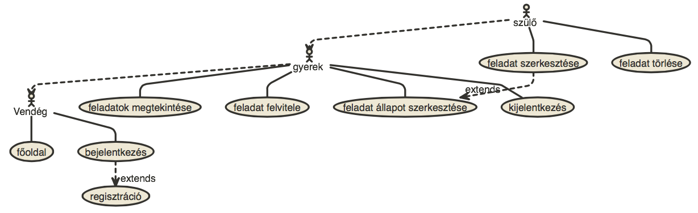

# Alkalmazások fejlesztése 1. beadandó

Téma: Családi TODO

## Követelmény-analízis

1. Követelmények

    1. Funkcionális elvárások
        - Látogatóként regisztráció az oldalra
        - Látogatóként bejelentkezés az oldalra
        - Felhasználóként a feladatok megtekintése
        - Felhasználóként feladat kiírása
        - Felhasználóként feladat szerkesztése
        - Szülőként feladat törlése
        - Főoldalon az alkalmazás ismertetése
    
    2. Nem-funkcionális elvárások
        - Felhasználóbarát kinézet
        - Hatákonyság
        - Biztonságos működés: jogosultságok megfelelő ellenőrzése, jelszavak titkosított tárolása

2. Használatieset-modell

    1. Szerepkörök
        1. Vendég
            -főoldal megtekintése
            -bejelentkezés
            -regisztráció
            
        2. Felhasználó
            -Vendég szerepköre
            -feladatok megtekintése
            -a neki szánt feladatok állapotának módosítása

        3. Admin
            -Felhasználó szerepköre
            -feladat teljeskörű szerkesztése
            -feladat törlése
    
    2. Használatieset diagram
        
    
    3. Folyamatok pontos menete
        1. Új feladat 
        2. Feladat módosítás 
        3. Feladat törlés 

## Tervezés

    1. Architektúra terv
        1. Komponensdiagram
        
        2. Oldaltérkép
            **Publikus:**
                - Főoldal
                - Bejelentkezés
                - Regisztráció
                
            **Bejelentkezve:**
                - Főoldal
                - Kijelentkezés
                - Feladatok listája
                    + új feladat
                    + feladat szerkesztése
                    + feladat törlése (adminként)

        3. Végpontok
            - GET /: főoldal
            - GET /login: bejelentkezés
            - POST /login: bejelentkezési adatok feldolgozása
            - GET /logout: kijelentkezés
            - GET /signup: regisztráció
            - POST /signup: regisztrációs adatok feldolgozása
            - GET /todos/list: feladatok listázása
            - GET /todos/new: új feladat bejegyzése
            - POST /todos/new: újonnan bejegyzett adat feldolgozása
            - GET /todos/edit/:id: feladat szerkesztése
            - POST /todos/edit/:id: szerkesztett adat feldolgozása
            - GET /todos/delete/:id: feladat törlése

    2. Felhasználóifelület-modell
        1. Oldalvázlatok
        2. Designterv (nem kell, elég a végső megvalósítás kinézete)

    3. Osztálymodell
        1. Adatmodell
        2. Adatbázisterv
        3. Állapotdiagram

    4. Dinamikus működés
        1. Szekvenciadiagram

## Implementáció
    1. Fejlesztői környezet bemutatása
        - Cloud9, felhőalapú IDE
        - Heroku, felhőalapú applikációs platform
        - GitHub, online verziókövető rendszer

    2. Könyvtárstruktúrában lévő mappák funkiójának bemutatása
        - models: adatmodellek
        - views: nézetek
        - node_modules: szükséges modulok

## Tesztelés
    Automatikus tesztek szükségesek. Nem kell teljeskörű tesztelés, a hallgató mutassa meg, hogy képes ilyen tesztek írására.
    
    1. Tesztelési környezet bemutatása
    2. Egységtesztek: legalább 1 adatmodell tesztelése
    3. Funkcionális felületi tesztek: legalább 1 folyamat tesztelése
        1. VAGY: Selenium IDE használatával
        2. VAGY: zombie.js használatával
    4. Tesztesetek felsorolása: milyen eseteket próbált végig a hallgató

## Felhasználói dokumentáció
    1. A futtatáshoz ajánlott hardver-, szoftver konfiguráció
        A heroku platform használata javasolt, Cloud9-al és GitHub-al együtt.
        Helyileg is futtatható, ehhez további előkészületek szükségesek:
            - nodejs (+ npm) telepítése
            - ha herokut használunk, a heroku-toolbelt és a git telepítése
        
        A hardverkövetelmények minimálisak.
    2. Telepítés lépései
        Helyi gépen (vagy Cloud9-on):

        - git clone https://github.com/horo42/alkfejl-bead.git
        - npm install
    3. A program 
        Az alábbi parancsok egyikével futtatható:
            - node index.js
            - nodemon index.js (ajánlott)